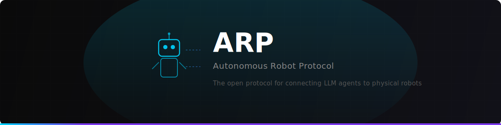
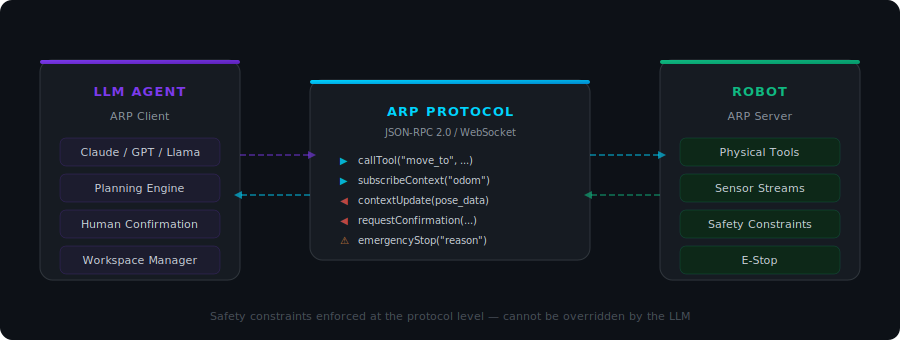

<p align="center">
  
</p>

<p align="center">
  <strong>The open protocol for connecting LLM agents to physical robots.</strong>
</p>

<p align="center">
  <a href="https://github.com/mariagorskikh/robotcontextprotocol/actions"></a>
  <a href="https://github.com/mariagorskikh/robotcontextprotocol/blob/main/LICENSE"></a>
  
  
  
  
</p>

<p align="center">
  <a href="https://github.com/mariagorskikh/robotcontextprotocol/tree/main/spec">Specification</a> &nbsp;&middot;&nbsp;
  <a href="https://github.com/mariagorskikh/robotcontextprotocol/tree/main/sdk/python">Python SDK</a> &nbsp;&middot;&nbsp;
  <a href="https://github.com/mariagorskikh/robotcontextprotocol/tree/main/examples">Examples</a> &nbsp;&middot;&nbsp;
  <a href="https://github.com/mariagorskikh/robotcontextprotocol/tree/main/schema">Schema</a>
</p>

---

## What is ARP?

ARP is a **protocol** — a standardized way for AI agents to discover, control, and monitor physical robots. Think [MCP](https://modelcontextprotocol.io) for the physical world.

Today, connecting an LLM to a robot requires custom integration every time. ARP changes that: wrap your robot in an **ARP server**, and any LLM agent can immediately control it through a universal interface — with safety constraints that the AI **cannot override**.

<p align="center">
  
</p>

## Key Features

<table>
<tr>
<td width="50%">

### Server Primitives (Robot → LLM)

| Primitive | Description |
|---|---|
| **Physical Tools** | Callable actions with safety metadata, preconditions, and execution state |
| **Physical Context** | Streaming sensor data with coordinate frames (odometry, camera, lidar) |
| **Safety Constraints** | Non-overridable rules enforced at protocol level |

</td>
<td width="50%">

### Client Primitives (LLM → Robot)

| Primitive | Description |
|---|---|
| **Planning** | Server requests LLM to generate or revise action plans |
| **Workspace** | Physical/logical boundaries the robot operates within |
| **Confirmation** | Human approval required for dangerous actions |

</td>
</tr>
</table>

<table>
<tr>
<td>🛡️ <strong>Safety-first</strong><br><sub>Constraints enforced at protocol level — LLMs cannot override workspace bounds, velocity limits, or force limits</sub></td>
<td>⚡ <strong>Real-time</strong><br><sub>Streaming sensor data and execution progress over WebSocket, not just request/response</sub></td>
<td>🤖 <strong>LLM-native</strong><br><sub>Designed for AI agents with tool discovery, natural language descriptions, and human-in-the-loop confirmation</sub></td>
<td>🔌 <strong>Universal</strong><br><sub>Any LLM, any robot. JSON-RPC 2.0 over WebSocket. Python SDK included, more coming.</sub></td>
</tr>
</table>

## Quick Start

### Install

```bash
pip install arp-sdk
```

Or install from source:

```bash
git clone https://github.com/mariagorskikh/robotcontextprotocol.git
cd robotcontextprotocol/sdk/python
pip install -e .
```

### 1. Define a Robot Server

```python
from arp_sdk import ARPServer, SafetyMetadata, SafetyLevel

server = ARPServer(name="my-robot", robot_model="Robot Arm v2")

@server.tool(
    description="Move arm to [x, y, z]",
    safety=SafetyMetadata(level=SafetyLevel.NORMAL),
    parameters={"target": {"type": "array"}},
)
async def move_to(target: list[float]) -> dict:
    # Your robot control code here
    return {"reached": target}

asyncio.run(server.run())  # ws://localhost:8765
```

### 2. Control from an LLM Agent

```python
from arp_sdk import ARPClient

client = ARPClient("ws://localhost:8765")
await client.connect()
await client.initialize()

# Discover what the robot can do
tools = await client.list_tools()

# Execute an action
result = await client.call_tool("move_to", target=[1.0, 0.5, 0.0])
print(result.state)  # "completed"

# Stream sensor data
await client.subscribe_context("odometry", callback, max_rate=10)

# Safety is enforced — this gets blocked
result = await client.call_tool("move_to", target=[999, 0, 0])
print(result.error)  # "Safety violation: exceeds workspace boundary"
```

## MCP vs ARP

| | MCP | ARP |
|---|---|---|
| **Domain** | Digital tools & APIs | Physical robots |
| **Safety** | Application-level | Protocol-level enforcement |
| **Real-time** | Request/response | Streaming context + progress |
| **Emergency Stop** | — | Built-in primitive |
| **Human-in-the-loop** | — | Confirmation primitive |
| **Coordinate Frames** | — | Native support |
| **Transport** | stdio / SSE | WebSocket (JSON-RPC 2.0) |

## Safety

ARP enforces safety at the **protocol level** — constraints cannot be bypassed by the LLM agent:

| Constraint | Description |
|---|---|
| 🔲 **Workspace bounds** | Reject motions outside defined boundaries |
| 🏎️ **Velocity limits** | Cap linear and angular speed |
| 💪 **Force limits** | Cap contact force and torque |
| 🚧 **Collision zones** | Define no-go regions |
| 🔴 **Emergency stop** | Immediate halt, callable by any party |
| ✋ **Human confirmation** | Required for critical/dangerous actions |

## Project Structure

```
robotcontextprotocol/
├── spec/                  # Protocol specification
│   └── specification.md
├── schema/                # JSON Schema for all messages
│   └── arp.schema.json
├── sdk/python/            # Python SDK
│   ├── arp_sdk/
│   │   ├── server.py      # ARPServer — define robot capabilities
│   │   ├── client.py      # ARPClient — connect and control
│   │   ├── types.py       # Pydantic models for all protocol types
│   │   └── transport.py   # WebSocket transport layer
│   └── tests/             # 72 tests (unit + integration)
├── examples/              # Working examples
│   ├── simple_robot_server.py
│   └── llm_agent_client.py
├── website/               # Project website
└── .github/workflows/     # CI (Python 3.11, 3.12, 3.13)
```

## Protocol Specification

The full spec lives at [`spec/specification.md`](spec/specification.md). Key design decisions:

- **Transport:** JSON-RPC 2.0 over WebSocket (`ws://` / `wss://`)
- **Types:** Pydantic models with full JSON Schema validation
- **Lifecycle:** `Initialize` → `Discover` → `Execute` → `Shutdown`
- **Error codes:** ARP-specific codes (`-40001` through `-40009`) for safety violations, confirmation timeouts, e-stop, etc.
- **State machine:** Tools go through `IDLE → RUNNING → COMPLETED/FAILED/CANCELLED` with progress notifications

## Development

```bash
# Clone and install
git clone https://github.com/mariagorskikh/robotcontextprotocol.git
cd robotcontextprotocol/sdk/python
pip install -e ".[dev]"

# Run tests
pytest tests/ -v
```

```
============================== 72 passed ==============================
```

## Roadmap

- [ ] TypeScript/JavaScript SDK
- [ ] ROS 2 bridge
- [ ] Authentication & TLS
- [ ] Protocol v0.2 with batch tool calls
- [ ] Simulator adapters (Isaac Sim, Gazebo, MuJoCo)
- [ ] PyPI package publication

## Contributing

ARP is an early-stage protocol. Contributions welcome — please [open an issue](https://github.com/mariagorskikh/robotcontextprotocol/issues) to discuss before submitting a PR.

## License

[Apache 2.0](LICENSE)

---

<p align="center">
  Built by <a href="https://github.com/mariagorskikh">Maria Gorskikh</a>
</p>
